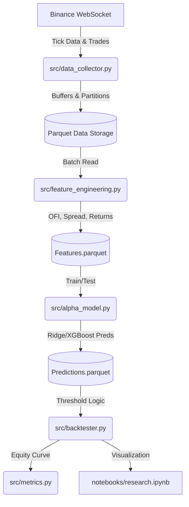

# Real-Time Order Book Alpha Research Engine

## Overview
This is an end-to-end quantitative research project designed to collect real-time cryptocurrency order book data, generate microstructure alpha signals, train predictive machine learning models, and evaluate trading strategies using a realistic backtesting engine.

It replicates the workflow used in professional quantitative trading research teams.

## Architecture Diagram


## How to Run

1. **Setup**: Install the dependencies.
   ```bash
   pip install -r requirements.txt
   ```
2. **Data Ingestion**: Start the data collector to begin saving data directly to your local disk.
   ```bash
   py -m src.data_collector
   ```
3. **Data Validation**: Check that data is properly captured in parquet files.
   ```bash
   py -m src.validate_data
   ```
4. **Feature Engineering**: Process the raw data.
   ```bash
   py -m src.feature_engineering
   ```
5. **Alpha Model Train/Predict**: Train the ML models and generate predictions.
   ```bash
   py -m src.alpha_model
   ```
6. **Strategy Backtest**: Evaluate the predictions and view the metrics/equity curve.
   ```bash
   py -m src.backtester
   ```

## Testing
To run the automated test suite testing the feature pipeline and metrics:
```bash
py -m unittest tests/test_pipeline.py
```
